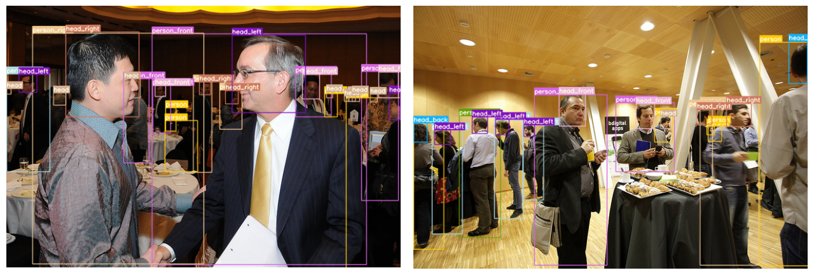

# yolo_bho

In this repository, we propose to extend the [coco dataset](https://cocodataset.org/#home) by adding head bounding box, 
as well as body and head orientation, with 4 possible orientations: front, back, right and left.


The proposed method for generating our dataset is as follows:
- Train a neural network (ie [yoloV7](https://github.com/WongKinYiu/yolov7)) to detect heads in images.
- Apply this first model to the coco dataset.
- Match the detected heads to the bounding boxes of bodies already present in the dataset.
- Use the keypoints associated with each body to calculate body and head orientation.
- Train a second model on this new dataset.

## Head detection

### Datasets

- Crowd Human Dataset: https://www.crowdhuman.org/

[Data preparation](CrowdHuman_preparation.ipynb)

- Hollywood Dataset: https://www.di.ens.fr/willow/research/headdetection/

[Data preparation](HollywoodHeads_preparation.ipynb)

- Scut HEAD Dataset: https://github.com/HCIILAB/SCUT-HEAD-Dataset-Release

### Yolo for head detection

To add the head bounding boxes to the coco dataset, we trained a YoloV7. Due to hardware constraints, training was 
carried out with the following parameters:
- Starting weight: yolov7-e6_training.pt
- Batch-size: 4
- Image size: 640
- Dataset: HollyWood Dataset only 

The resulting model is available here: [yolo_head.zip](data/yolo_head.zip)

Its results are as follows:

| Dataset    | Set | Images | Labels | Image Size | P     | R     | mAP 0.5 | mAP 0.95 |
|------------|-----|--------|--------|------------|-------|-------|---------|----------|
| HollyWood  | val | 6676   | 11536  | 640x640    | 0.952 | 0.897 | 0.944   | 0.589    |
| HollyWood  | val | 6676   | 11536  | 1280x1280  | 0.914 | 0.857 | 0.908   | 0.537    |
| CrowdHuman | val | 4362   | 98020  | 640x640    | 0.86  | 0.743 | 0.812   | 0.489    |
| CrowdHuman | val | 4362   | 98020  | 1280x1280  | 0.867 | 0.787 | 0.863   | 0.539    |

## Coco Head Detection

Inference on the Coco dataset has so far been carried out with the previous model and an image size of 640x640, 
optimally the size should rather be 1280x1280.

Command:
```bash
python detect.py --weights faces_opt.pt --source coco/images/train2017/ --save-conf --save-txt --project homemade/coco_head --name train2017 --nosave
python detect.py --weights faces_opt.pt --source coco/images/val2017/ --save-conf --save-txt --project homemade/coco_head --name val2017 --nosave
```

The resulting bounding boxes are available here:

## Body and Head matching + orientation

To proceed, you need to put the coco dataset at the root of the project (or a symlink): 

```bash
yolo_bho/
├── coco
│   ├── annotations
│   ├── images
│   ├── LICENSE
│   └── README.txt
├── coco_body_head.ipynb
├── utils
│   └── cocoset.py
...
```

Then run the following notebook (remember to set the dataset variable to 'train' and 'val' to get train and val
datasets):

[Coco Body Head](coco_body_head.ipynb)

Results:
- train2017: [train2017.zip](data/train2017.zip)
- val2017: [val2017.zip](data/val2017.zip)

> **_NOTE:_**  Some of the files in train2017.zip contain a 6th value for each bbox, which is confidence score. 
> This is not a problem for the processing chain in next step.

## Yolo for head and body orientation detection

To train yolo, we recommend to use the following structure:
```bash
homemade/coco_body_head/
├── cfg
│   └── cfg_body_head.yaml
├── data
│   └── data_body_head.yaml
├── images -> ../../coco/images/
└── labels
    ├── train2017
    └── val2017
```

```bash
python train.py 
  --weights weights/yolov7-e6_training.pt 
  --cfg homemade/coco_body_head/cfg/cfg_body_head.yaml 
  --data homemade/coco_body_head/data/data_body_head.yaml 
  --img-size 640 
  --batch-size 4 
  --save_period 5 
  --name yolo_bho 
```

Our model: [yolo_bho.zip](data/yolo_bho.zip)

| Dataset  | Set | Images | Labels | Image Size | P     | R     | mAP 0.5 | mAP 0.95 |
|----------|-----|--------|--------|------------|-------|-------|---------|----------|
| Coco_bho | val | 4299   | 42225  | 640x640    | 0.678 | 0.604 | 0.652   | 0.467    |
| Coco_bho | val | 4299   | 42225  | 1280x1280  | 0.605 | 0.58  | 0.596   | 0.408    |

                      